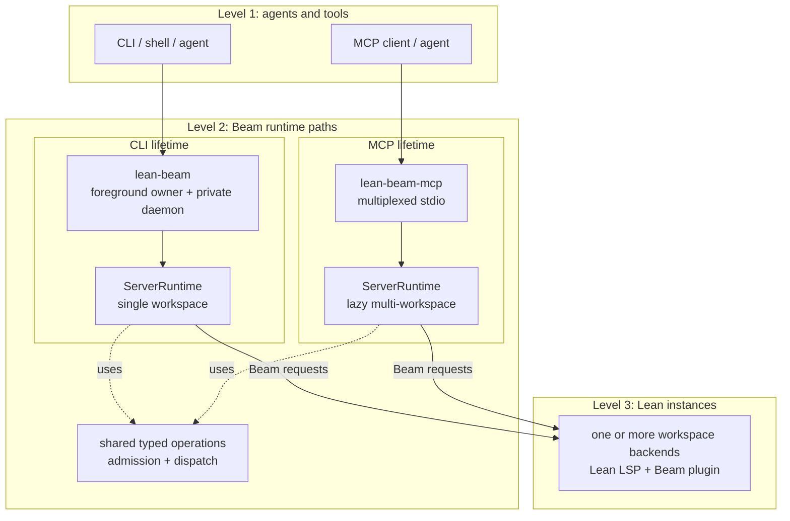

# Lean Beam

Lean Beam is a preview project for efficient interaction with Lean from AI agents and other tools.
It combines new [Lean LSP extensions](docs/STATUS.md#core-lean-surface) with a thin local broker.
The extensions provide Lean-specific capabilities, and the broker exposes them through a
[`lean-beam` CLI](docs/SETUP.md#use-beam-from-a-lean-project) and an
[MCP server](docs/SETUP.md#mcp-setup) for agent- and tool-facing workflows.



Beam keeps the agent-facing surface small. The CLI and MCP paths share typed operations and broker
runtime code, but each owns its transport and runtime lifetime. Those runtime instances own request
routing plus one or more Lean LSP sessions with the Beam plugin loaded.

Beam lets a client try Lean commands or tactics at specific positions in saved files without
changing those files. The central Beam extension is speculative execution through
[`runAt`](docs/STATUS.md#core-lean-surface), exposed by the CLI as
[`lean-beam run-at`](docs/SETUP.md#use-beam-from-a-lean-project) and through MCP as
[`lean_run_at`](docs/MCP.md#public-tools). Because these probes can be issued
concurrently, agents and tools can cheaply explore several "would this work here?" possibilities in
the real module context.

Together, the LSP extensions, CLI, and MCP interface are intended to make that loop cheaper and more
structured than repeatedly creating scratch files or using full `lake build` runs as the inner loop.

People comparing Lean tool integrations should also see
[docs/RELATED_TOOLS.md](docs/RELATED_TOOLS.md) for a descriptive comparison with `lean-lsp-mcp` and
Pantograph.

Beam is implemented in Lean, which lets it integrate more directly with Lean server state, saved
snapshots, and synchronization where that matters.

We have found Beam useful for proof repair, proof search experiments, proof translation and porting,
autoformalization experiments, and regular AI-assisted Lean editing.

Feedback is welcome through GitHub issues or Lean Zulip. For structured bug reports from a local
checkout, `lean-beam feedback-report --stdin` can produce a pasteable report card; see
[docs/FEEDBACK.md](docs/FEEDBACK.md). Review non-confidential cards before posting them publicly;
set `"confidential": true` in the feedback input JSON for a non-public workspace and never post that
report publicly. Beam does not upload or submit the report.

Lean Beam is currently available as a preview. We are working to stabilize it into dependable agent
tooling for everyday Lean use and prepare it for distribution with Lean. Until that work lands,
Beam is installed separately, its interfaces may change, and its current scope and limitations are
tracked in [docs/STATUS.md](docs/STATUS.md).

Most readers should start with [Install](#install), then use [docs/SETUP.md](docs/SETUP.md) for
toolchains, first CLI commands, agent-skill setup, and MCP registration. Release-facing changes are
tracked in [CHANGELOG.md](CHANGELOG.md).

## Current Beta Surface

The current development line includes support for:

- speculative Lean execution with [`runAt`](docs/STATUS.md#core-lean-surface)
- incremental synchronization of Lean's view of a file after edits with
  [`sync`](docs/SYNC_AND_DIAGNOSTICS.md#command-model)
- actionable file information with [`todo`](docs/STATUS.md#core-lean-surface), including sorries,
  holes, diagnostics, code actions, and incomplete proofs
- creating development `.olean` checkpoints from an interactive session with
  [`save`](docs/SYNC_AND_DIAGNOSTICS.md#command-model)
- selected Lean/LSP features through the same
  [CLI](docs/SETUP.md#use-beam-from-a-lean-project) and
  [MCP](docs/MCP.md#public-tools) interfaces, including hover, signature help,
  definitions, references, document/workspace symbols, and proof-state inspection
- feedback report cards for bug reports and project feedback through
  [`lean-beam feedback-report`](docs/FEEDBACK.md) and MCP
  [`beam_feedback_report`](docs/FEEDBACK.md#mcp)

See [docs/STATUS.md](docs/STATUS.md) for the current supported surface, known limitations, and
release direction.

Beam checkpoints accelerate the development loop by writing the Lean server's accepted state,
including structured Lake options, dynamic libraries, and plugins already applied by the file
worker. Modules with batch-only `moreLeanArgs` fail with `saveUnsupportedSetup`: move shared `-D`
settings to `leanOptions`, or use `lake build` when the arguments are intentionally batch-only. A
running Lean server is not guaranteed to pick up Lake workspace configuration changes; after such a
change, run `lean-beam --root ROOT stop`, then start a new foreground `lean-beam serve` wrapper
session before the next wrapper command that uses the Lean server. A successful
checkpoint is normally sufficient while working; do not add an expensive clean build to every Beam
loop. Final project validation should come from CI running `lake build` from clean Lake artifacts.
If no successful clean CI result is available, or server-sensitive elaboration is suspected, use the
one-time local batch check described in the
[sync and diagnostics contract](docs/SYNC_AND_DIAGNOSTICS.md#development-checkpoints-and-batch-validation).

## Install

Install or update Beam from a Lean Beam checkout:

```bash
./scripts/install-beam.sh
```

Run the installer again when you update the checkout and want the installed runtime to match it.
Setup details, validated and compatible toolchains, agent-skill installation, MCP registration,
direct CLI examples, installer locations, overrides, and offline advice live in
[docs/SETUP.md](docs/SETUP.md).

Beam retains prior immutable runtime payloads so updates remain atomic. Use `lean-beam prune` to
preview old installed state and follow the [prune guide](docs/SETUP.md#prune-old-installed-state)
before applying cleanup.

Lean Beam fully validates exact toolchains listed in
[`validated-lean-toolchains`](validated-lean-toolchains) and locally qualifies canonical RC/patch
variants from [`compatible-lean-release-lines`](compatible-lean-release-lines). See
[docs/SETUP.md](docs/SETUP.md#validated-and-compatible-toolchains) for bundle setup and
[docs/CUSTOM_TOOLCHAINS.md](docs/CUSTOM_TOOLCHAINS.md) for explicitly accepted local Lean builds.

## Documentation Map

For users:

- [docs/SETUP.md](docs/SETUP.md): install, toolchain, first-use, MCP, and installer reference.
- [docs/CUSTOM_TOOLCHAINS.md](docs/CUSTOM_TOOLCHAINS.md): explicit local Lean toolchain support.
- [docs/COMPATIBILITY.md](docs/COMPATIBILITY.md): pre-stable compatibility policy and supported
  targets.
- [docs/ROCQ.md](docs/ROCQ.md): optional Rocq goal probes for Rocq-to-Lean porting.
- [docs/FEEDBACK.md](docs/FEEDBACK.md): feedback report cards for useful bug reports.
- [docs/RELATED_TOOLS.md](docs/RELATED_TOOLS.md): descriptive comparison with nearby Lean agent and
  proof-search tools.
- [docs/STATUS.md](docs/STATUS.md): current scope, limitations, and direction.
- [CHANGELOG.md](CHANGELOG.md): release-facing changes.

For agent workflows:

- [skills/lean-beam/SKILL.md](skills/lean-beam/SKILL.md): Lean workflow contract.
- [skills/rocq-beam/SKILL.md](skills/rocq-beam/SKILL.md): auxiliary Rocq workflow surface.

For contributors and maintainers:

- [CONTRIBUTING.md](CONTRIBUTING.md): commit, PR, and contributor workflow guidance.
- [docs/DEVELOPMENT.md](docs/DEVELOPMENT.md): maintainer workflow and implementation notes.
- [docs/TESTING.md](docs/TESTING.md): developer test-suite guidance and coverage map.
- [docs/SYNC_AND_DIAGNOSTICS.md](docs/SYNC_AND_DIAGNOSTICS.md): sync, refresh, save, progress,
  diagnostics, and readiness contract.
- [docs/MCP.md](docs/MCP.md): current MCP maintainer architecture and conformance notes.
- [AGENTS.md](AGENTS.md): repo-specific agent instructions.

## Contributing And Help

The main goal of the beta development cycle is to gather feedback from Lean users and tool authors.
Bug reports, design feedback, and documentation improvements are welcome through
[GitHub issues](https://github.com/leanprover/lean-beam/issues). Discussion is also welcome on the
[Lean Zulip](https://leanprover.zulipchat.com).

Before contributing code or docs, read [CONTRIBUTING.md](CONTRIBUTING.md). Maintainer workflow notes
live in [docs/DEVELOPMENT.md](docs/DEVELOPMENT.md).

## License

Apache-2.0. See [LICENSE](LICENSE).
