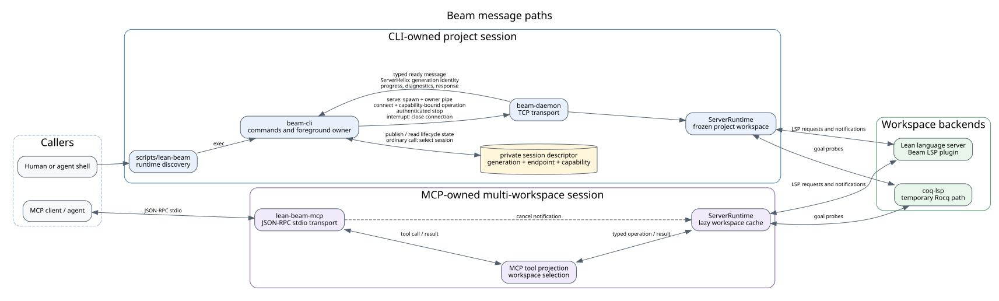
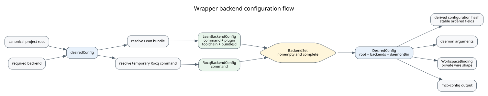

# Beam Architecture

Beam has two user-facing paths into the same typed Lean operations, but it does not share their
transport or lifetime coordination. The CLI owns a project session through a foreground
`lean-beam serve` process and a private daemon. The MCP server owns its broker runtime directly and
multiplexes calls over JSON-RPC on standard input and output.

The diagrams in this document are generated from the adjacent Graphviz sources. Update and render
both forms together when a component or message path changes. From the repository root, run:

```bash
dot -Tsvg docs/architecture/message-paths.dot -o docs/architecture/message-paths.svg
dot -Tsvg docs/architecture/configuration-flow.dot -o docs/architecture/configuration-flow.svg
```

## Message Paths

[Open the rendered message-path diagram](architecture/message-paths.svg), or inspect its
[Graphviz source](architecture/message-paths.dot).



The CLI session descriptor selects one generation and contains its TCP endpoint and capability.
An ordinary CLI operation reads that descriptor, verifies the daemon generation from the
same-connection greeting, and only then sends its capability-bound request. The foreground owner
alone creates the session and supervises normal shutdown. `status`, `stop`, and `recover` are
explicit lifecycle paths rather than Lean operations.

The MCP process does not attach to the CLI daemon. It owns an in-process `ServerRuntime`, resolves
workspace descriptors from MCP tool arguments, and lazily owns the corresponding backend sessions.
CLI and MCP reuse operation and runtime implementation, but each arrow in the diagram belongs to a
separate runtime instance.

## Backend Configuration Flow

[Open the rendered configuration-flow diagram](architecture/configuration-flow.svg), or inspect
its [Graphviz source](architecture/configuration-flow.dot).



`DesiredConfig` is the internal wrapper-session configuration. Every configured Lean backend owns
its command, plugin, toolchain, and bundle identity together. Temporary Rocq support is represented
as either an optional companion to Lean or the sole backend; an empty backend set and partial Lean
configuration cannot be constructed.

The session configuration hash is a pure projection of `DesiredConfig`, not separately stored
derived state. The established field order remains stable while the value cannot disagree with the
root, backend set, or daemon binary from which it was computed.

The option-heavy `WorkspaceBinding` remains a private descriptor and daemon-startup wire format.
It is produced only by lowering a complete `BackendSet`. This keeps protocol compatibility at the
edge without spreading independently optional Lean fields through configuration resolution,
hashing, daemon startup, and MCP setup output.
